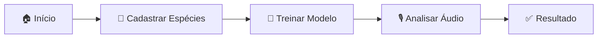

# 🐸 BioAcustic 2.0 - Sistema Multi-Páginas

<div align="center">


**Sistema de Classificação de Anfíbios por Vocalização usando Inteligência Artificial**

[🚀 Começar](#-começar-agora) • [📚 Docs](docs/) • [🎯 Features](#-features) • [🛠️ Stack](#️-stack-tecnológico)

</div>

---

## 🎯 O que é o BioAcustic?

Sistema **100% offline** que usa **Deep Learning** para identificar espécies de anfíbios através de suas vocalizações. Ideal para pesquisadores, biólogos e entusiastas da biodiversidade.

### 🌟 Principais Diferenciais

- ✅ **Offline-First**: Funciona completamente no navegador
- ✅ **Treinamento Custom**: Treine com seus próprios dados
- ✅ **Busca Automática**: Integração com APIs científicas (GBIF, Wikipedia)
- ✅ **Export Completo**: JSON, CSV, modelos TensorFlow
- ✅ **Zero Configuração**: Abra e use

---

## 📁 Estrutura do Projeto

```
frontend/
├── 📄 index.html              ← Landing page moderna
├── 🎙️ analyze.html            ← Análise de vocalizações
├── 🧠 train.html              ← Treinamento de modelos
├── 🐸 species.html            ← Gerenciamento de espécies
├── ⚙️ settings.html           ← Configurações e exportações
│
├── js/
│   ├── 🧭 navbar.js           ← Navegação compartilhada
│   ├── 💾 storage.js          ← IndexedDB + localStorage
│   ├── 🤖 app.js              ← Lógica de análise
│   ├── 🎓 training.js         ← Lógica de treinamento
│   └── 🔍 species-info.js     ← Busca automática (GBIF/Wiki)
│
├── docs/
│   ├── 📖 QUICK_START.md      ← Guia de início rápido
│   ├── 📐 REDESIGN_MULTI_PAGE.md
│   └── 🔬 SPECIES_INFO_FEATURE.md
│
└── assets/
    └── 🖼️ images/
```

---

## 🚀 Começar Agora

### 1️⃣ Abrir o Sistema

```bash
# Clone o repositório
git clone https://github.com/SemaRibas/BioAcustic.git

# Entre na pasta frontend
cd BioAcustic/frontend

# Abra index.html no navegador
# OU use Live Server do VS Code
```

### 2️⃣ Fluxo Básico



### 3️⃣ Tutorial 5 Minutos

1. **Cadastrar Espécie** (1 min)
   - Vá em 🐸 Espécies → Nova Espécie
   - Digite: `Boana faber`
   - Clique: Buscar informações automaticamente
   - Salvar

2. **Treinar Modelo** (3 min)
   - Vá em 🧠 Treinamento
   - Adicione 5+ áudios para 2-3 espécies
   - Treinar Modelo (50 épocas)

3. **Analisar** (1 min)
   - Vá em 🎙️ Análise
   - Upload ou grave áudio
   - Analisar Vocalização

---

## 🎯 Features

### 🎙️ Análise de Vocalização

- ✅ Upload de arquivos (WAV, MP3, OGG)
- ✅ Gravação direta pelo navegador
- ✅ Visualização de waveform
- ✅ Espectrograma em tempo real
- ✅ Resultados com confidence score
- ✅ Busca automática de informações da espécie

### 🧠 Treinamento

- ✅ CNN customizável
- ✅ Data augmentation
- ✅ Transfer learning
- ✅ Gráficos de Loss/Accuracy em tempo real
- ✅ Early stopping
- ✅ Confusion matrix
- ✅ Export/Import de modelos

### 🐸 Gerenciamento de Espécies

- ✅ CRUD completo
- ✅ Busca automática em APIs científicas
- ✅ Taxonomia completa (Reino → Gênero)
- ✅ Status de conservação IUCN
- ✅ Imagens e descrições
- ✅ Filtros e busca
- ✅ Export CSV/JSON

### ⚙️ Configurações

- ✅ Ajuste de threshold
- ✅ Configurações de treinamento
- ✅ Export/Import de dados
- ✅ Estatísticas de uso
- ✅ Backup automático

---

## 🛠️ Stack Tecnológico

| Categoria | Tecnologia | Versão | Uso |
|-----------|------------|--------|-----|
| **ML** | TensorFlow.js | 4.22.0 | Deep Learning |
| **UI** | Tailwind CSS | 3.x | Estilização |
| **Audio** | WaveSurfer.js | 7.x | Visualização |
| **Charts** | Chart.js | 4.x | Gráficos |
| **Storage** | IndexedDB | Native | Banco local |
| **APIs** | GBIF + Wikipedia | - | Dados científicos |

---

## 📊 Screenshots

### 🏠 Página Inicial
Apresentação moderna com hero section, features e call-to-action

### 🎙️ Análise
Interface de upload/gravação com visualização de waveform e resultados

### 🧠 Treinamento
Dashboard com gráficos de métricas e controles de treinamento

### 🐸 Espécies
Tabela com busca, filtros e integração com APIs científicas

### ⚙️ Configurações
Painéis de configuração, estatísticas e exportação de dados

---

## 🎓 Arquitetura

### Fluxo de Dados

```
┌─────────────────────────────────────────┐
│           User Interface (HTML)         │
│  index | analyze | train | species |   │
│                settings                 │
└────────────────┬────────────────────────┘
                 │
        ┌────────┴────────┐
        │   navbar.js     │  ← Navegação
        └────────┬────────┘
                 │
    ┌────────────┴─────────────┐
    │                          │
┌───▼────┐              ┌─────▼────┐
│ app.js │              │storage.js│
│        │              │          │
│Análise │◄────────────►│IndexedDB │
│        │              │localStorage│
└───┬────┘              └─────┬────┘
    │                         │
┌───▼────────┐          ┌─────▼──────┐
│training.js │          │species-    │
│            │          │info.js     │
│Treinamento │          │            │
│            │          │API Fetcher │
└────────────┘          └────────────┘
```

### IndexedDB Schema

```javascript
BioAcusticDB (v1)
├── species          // Banco de espécies
│   ├── id (key)
│   ├── scientificName (index)
│   ├── commonName (index)
│   ├── taxonomy {...}
│   └── ...
│
├── audios           // Arquivos de áudio
│   ├── id (key)
│   ├── speciesId (index)
│   ├── timestamp (index)
│   └── blob
│
├── models           // Modelos treinados
│   ├── id (key)
│   ├── name (index)
│   ├── modelData
│   └── metadata
│
└── analyses         // Histórico
    ├── id (key)
    ├── audioId (index)
    ├── predictions
    └── timestamp (index)
```

---

## 📚 Documentação Completa

| Documento | Descrição |
|-----------|-----------|
| [QUICK_START.md](docs/QUICK_START.md) | Tutorial passo a passo |
| [REDESIGN_MULTI_PAGE.md](docs/REDESIGN_MULTI_PAGE.md) | Arquitetura do sistema |
| [SPECIES_INFO_FEATURE.md](docs/SPECIES_INFO_FEATURE.md) | Sistema de busca |
| [DESIGN_GUIDE.md](DESIGN_GUIDE.md) | Guia de design |

---

## 🤝 Contribuindo

Contribuições são bem-vindas! Para contribuir:

1. Fork o projeto
2. Crie uma branch: `git checkout -b feature/nova-feature`
3. Commit: `git commit -m 'Adiciona nova feature'`
4. Push: `git push origin feature/nova-feature`
5. Abra um Pull Request

### 📋 Roadmap

- [ ] Dark mode
- [ ] PWA (Progressive Web App)
- [ ] Internacionalização (i18n)
- [ ] Sincronização em nuvem
- [ ] Mapa de distribuição de espécies
- [ ] Análise em lote
- [ ] Integração com iNaturalist

---

## 🐛 Problemas Conhecidos

| Issue | Status | Workaround |
|-------|--------|------------|
| Safari < 14 não suporta WaveSurfer | 🔴 Conhecido | Use Chrome/Firefox |
| IndexedDB em modo privado falha | 🔴 Limitação | Use modo normal |
| Áudios muito longos (>5min) podem travar | 🟡 Investigando | Divida em segmentos |

---

## 📈 Performance

### Benchmarks (Chrome 120, i5-8250U, 8GB RAM)

| Operação | Tempo | Notas |
|----------|-------|-------|
| Análise de áudio (3s) | ~1.5s | Inclui extração de features |
| Treinamento (3 classes, 30 amostras) | ~2min | 50 épocas, batch 32 |
| Busca automática (GBIF+Wiki) | ~2s | Depende da rede |
| Carregamento de modelo | ~500ms | Cache do browser |

---

## 🔒 Privacidade

- ✅ **100% offline**: Dados nunca saem do seu computador
- ✅ **Sem analytics**: Zero rastreamento
- ✅ **Sem cookies**: Apenas localStorage/IndexedDB
- ✅ **Código aberto**: Audite você mesmo

**Exceção**: Busca automática de espécies requer APIs externas (GBIF, Wikipedia)

---

## 📄 Licença

Este projeto é licenciado sob a licença MIT - veja o arquivo [LICENSE](LICENSE) para detalhes.

---

## 🙏 Agradecimentos

- **TensorFlow.js Team** - Framework de ML
- **GBIF** - Dados de biodiversidade
- **Wikipedia/Wikidata** - Informações científicas
- **Tailwind CSS** - Framework UI
- **Comunidade Open Source** - Inspiração e suporte

---

## 📞 Contato

- 💼 **Autor**: Sema Ribas
- 📧 **Email**: sema@bioacustic.com
- 🐛 **Issues**: [GitHub Issues](https://github.com/SemaRibas/BioAcustic/issues)
- 💬 **Discussões**: [GitHub Discussions](https://github.com/SemaRibas/BioAcustic/discussions)

---

## ⭐ Estatísticas


---

<div align="center">

**Desenvolvido com 💚 para a conservação da biodiversidade**

[⬆ Voltar ao topo](#-bioacustic-20---sistema-multi-páginas)

</div>
